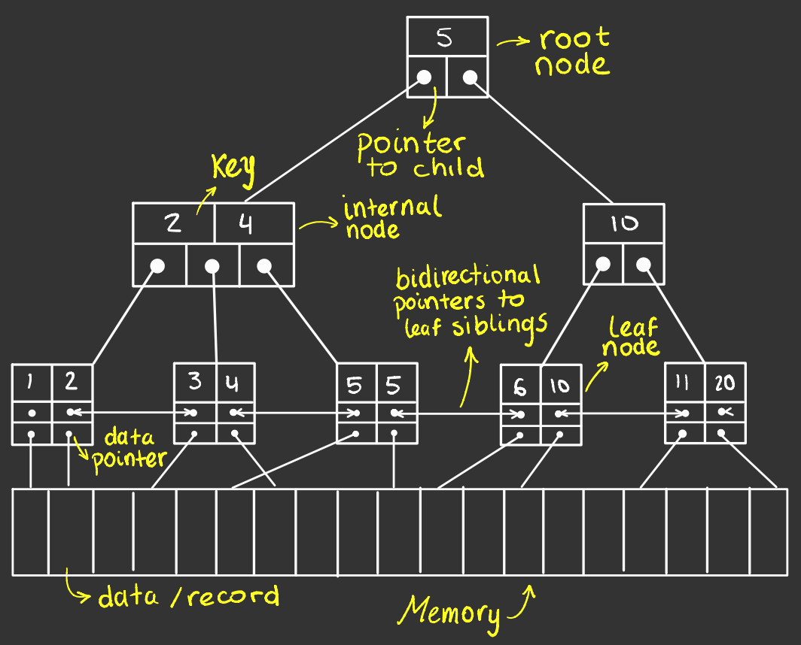

# B+ Tree C++ implementation

<p align="center">

</p>

## Run the project

This project do not use any dependencies, just the ```Standard Template Library```

```zsh
git clone https://github.com/ByJuanDiego/b-plus-tree.git
cd b-plus-tree
chmod +x run.zsh
./run.zsh
```

## Member functions

All the search operations returns an ```std::list<V>``` and are made on a $O(log_{M}(n) + k)$ time complexity, where $k$
is the cost of traversing the leaf nodes and could be different depending on the type of search, and the logarithmic
function belongs to the cost of descending in the tree.

|                            Member Function                             |                                                                                                       Optional Parameters                                                                                                       |
|:----------------------------------------------------------------------:|:-------------------------------------------------------------------------------------------------------------------------------------------------------------------------------------------------------------------------------:|
|              ```search_below(K max, bool include_max)```               |                                       the search returned ***do not include*** the superior limit for default, to include it, set the optional parameter ```include_max``` as ```true```                                        |
|              ```search_above(K min, bool include_min)```               |                                       the search returned ***do not include*** the inferior limit for default, to include it, set the optional parameter ```include_min``` as ```true```                                        |
| ```search_between(K min, K max, bool include_min, bool include_max)``` | the search returned ***includes*** both limits (inferior and superior) for default; to ***exclude*** one or both limits, set the ```include_min``` or ```include_max``` values to ```false``` depending on the desired semantic |

# Usage Cases

## Initialization

```c++
auto index = [&](const transaction *tx) -> int { return tx->amount; };
auto greater = [&](int a, int b) -> bool { return a > b; };
b_plus_tree<4, int, transaction *, decltype(greater), decltype(index)> bPlusTree(index, greater);
```

```index``` function recieves a value and returns the attribute that will be used for indexing values

```greater``` is a function that, trivially, returns if an indexing value is greater than another

> - this last function do not need to be passed as parameter; in that case, the type is assigned to ```std::greater```
    by default. If the indexing attribute is not a comparable type by default (which is not recomendable)
    a [specialization of ```std::greater```](https://en.cppreference.com/w/cpp/utility/functional/greater) is necesary

## Querying

```c++
int min {10}, max{97};
bool include_min {true}, include_max {false};
for (const transaction *tx: bPlusTree.search_between(min, max, include_min, include_max)) {
    std::cout << tx->to_string() << std::endl;
}
```

This query returns all the ```transactions``` which ```amount``` value is between ```10 (inclusive)```
and ```97 (exclusive)``` in a non-decreasing order.

## Freeing memory

If the ```value-type``` is a pointer, the pointed values will not be freed when ```b_plus_tree::~b_plus_tree```  is
called. This is manual process.

```c++
for (transaction *tx: destructor) {
    delete tx;
}
```

# To be implemented

- ```remove()``` member function
- ```iterator``` class for B+
